# Preamble

As you might have already read in my other [blog post]({{site.baseurl}}/docs/Radio/Creating a helix for direct satrx), I have been wanting to do satellite reception on the go for a while now. Back in March 2025, I created a proof of concept design which was incredibly easy to make and provided good results, but with one big caveat: **transportability**. 

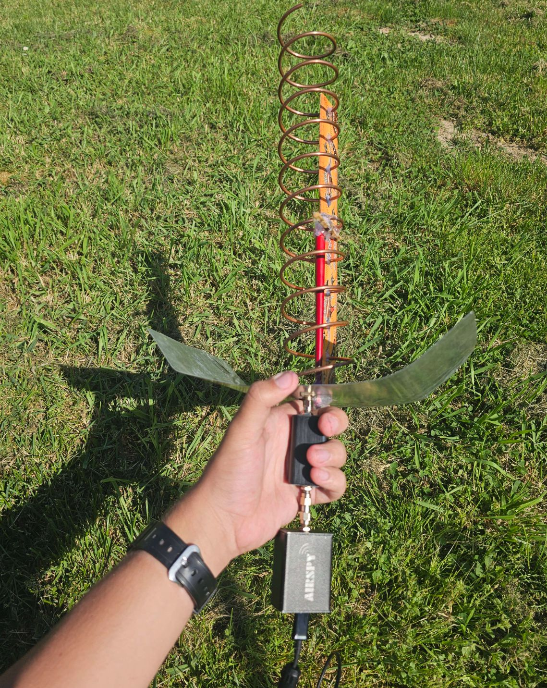
*My old design from 03-2025*

Since the helix had a relatively large footprint, I had to carry it in a tote bag to bring it anywhere. This didn't bother me much at that time, as the place where I did satellite reception was just a 5-minute walk from my front door. At my cottage, I didn't use this design at all, as I could just cycle two minutes to a local spot with a dish in my hand - at that distance it's easy to deal with.

Ever since I moved to the Netherlands for University, I haven't had the liberty of a dish accessible anywhere anymore. And, to add insult to injury, the closest viable spot for low-elevation reception is a good >5 km away. While a tote bag would still work, I normally keep all my equipment in a backpack - carrying both seemed silly to me. So, I decided to revisit the direct reception helix design with an idea I had a while ago:

# How to fit a helix in a backpack?

The biggest constraint is easily the ground plane. A standard setup consists of a tall but narrow helix which is soldered to a big flat square. The size of this plate has a very significant effect on signal strength, as it is acting as the primary reflector. The smallest viable size is already a (relatively) huge massive **15x15 centimeters**.

Considering the depth\*width dimensions are the limiting factor of what I can fit into a backpack, I thought about being able to take the helix off the ground plane to be able to store the plate on its side - that would make the whole setup no bigger than a book and a water bottle!

The obvious issue is, that the helix is soldered to the SMA port which is drilled into the plate itself. Resoldering it every time would be tedious, so I came up with the idea of **making a separate, smaller ground plane which screws into a big, primary one**. This would allow the helix to be attached and soldered to the smaller plate, with a big one attached to it by a couple of bolts. That makes it very easy to (dis)assemble!

# Assembly guide

I will present the manufacturing as a guide you can replicate yourself, showing how I did it along the way.

## Materials

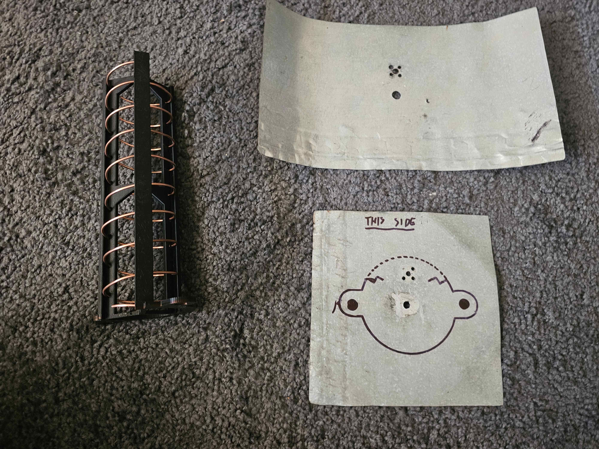  
*Prepared 9 turn RHCP helix, a 17x25 cm plate, and an old 17x17 cm plate.*

You first need to get some materials - two plates and a helix. One plate is sacrificial in a sense, as you only need just enough to cover the helix stand.

The other plate is used as the actual reflector - the mentality of "the bigger, the better" applies here; I suggest you use 17x17 cm as the minimum. Going wider offers a significant benefit here - don't forget that you will be storing it sideways! I arbitrarily went for 17x25 cm.

> Notice how the edges are bent up, this helps reduce unwanted side lobes! It is also necessary if you go above roughly 20 cm, as the signal just reflects straight back to the satellite instead of hitting the helix beyond that point. Play around with it until you find what works best for you.

The helix itself is just standard RHCP 1700 MHz, with the turn amount not mattering much beyond roughly 9. Just go with however much you think your printer can do while maintaining structural rigidity. It is a good idea to print it out of PETG or other equivalently strong pieces of plastic. It's also wise to use good infill settings (i.e. gyroid, 40%).

> [Scaffold](https://github.com/sgcderek/helix-antenna-scaffold) used, ©Dereksgc. Make adjustments to the .SCAD file, then export it to .STL with online tools/whatever else you use for 3D modelling.

As for the SMA, get a flanged one, preferably male with a Teflon extension. An example is [here](https://nl.aliexpress.com/item/1005004955619104.html). The square flange allows the SMA to take structural pressure in all sides, while the Teflon extension provides a slight SNR boost.

## Preparing plates

### Small (Helix) plate

Since I reused plates from my old direct reception helices, I already had holes pre-drilled for the SMA. You can drill these yourself by drilling exactly 2.75 cm from the center of the plate, pushing the SMA through temporarily, marking the mounting holes your flanged SMA uses, then drilling those as well.

Now it's time for the scaffold mounting. For mine, I specifically chose 11 cm spacing with 11 mm diameter bolts, which seemed like a sweet spot offering good structural rigidity when the feed is screwed together. You can choose any spacing and screw size you want, but I don't advise going below M6 for the screw size or < 10 cm for the spacing to avoid structural issues.

Now that you have the holes drilled, put the scaffold on the plate and screw it in. Trace the outline, then remove the scaffold once again. You now have to cut out the shape just around the metal plate - I used metal cutting pliers for this. Try to make the edges smooth for your sake - more metal doesn't hurt, it just makes it a bit more difficult to store since the size goes up.

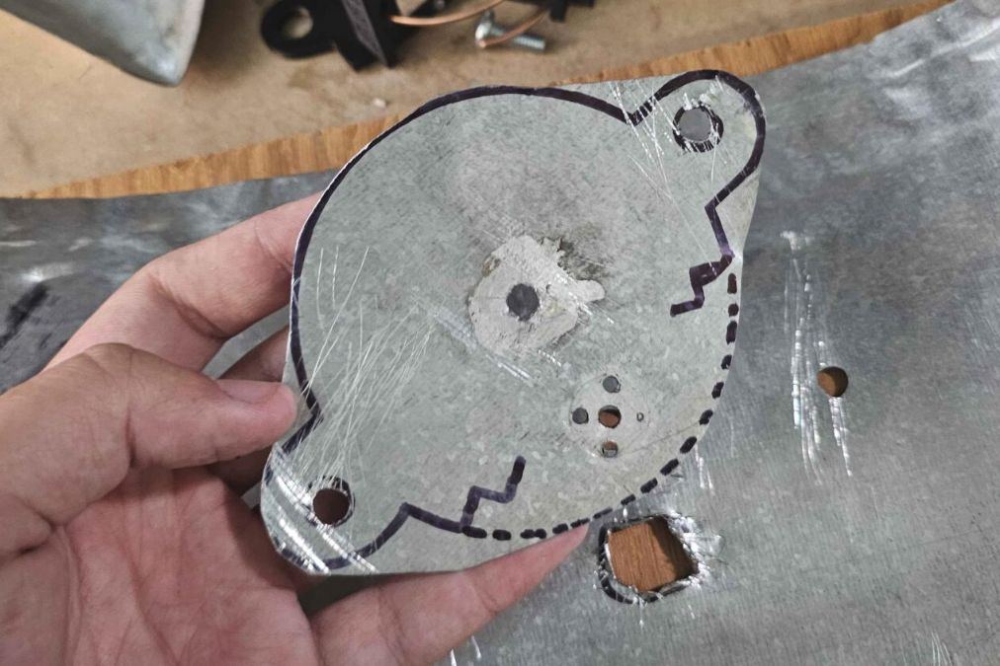  
*See how I cut just around the outline - this allows the helix to have something to mechanically lean up against, as well as giving us space to later put hot glue/other adhesives to keep it tied down.*

### Big (Primary) plate

Cutting the primary plate is tricky. I advise you to first drill out the same two mounting holes you did for the small plate, then screw the small plate onto the big one. You can then trace the SMA holes to perfectly see where the SMA will go. The goal is to drill/cut out a hole big enough for the **whole SMA port to pass through**. Electrical continuity is provided by mounting pressure from the bolts, the port itself just has to remain accessible.

This part sucked to do in my case because of the lack of hardware tools. I had to resort to using the pliers and a lot of patience. By some miracle I didn't cut my hand off and didn't *completely* massacre the plate:

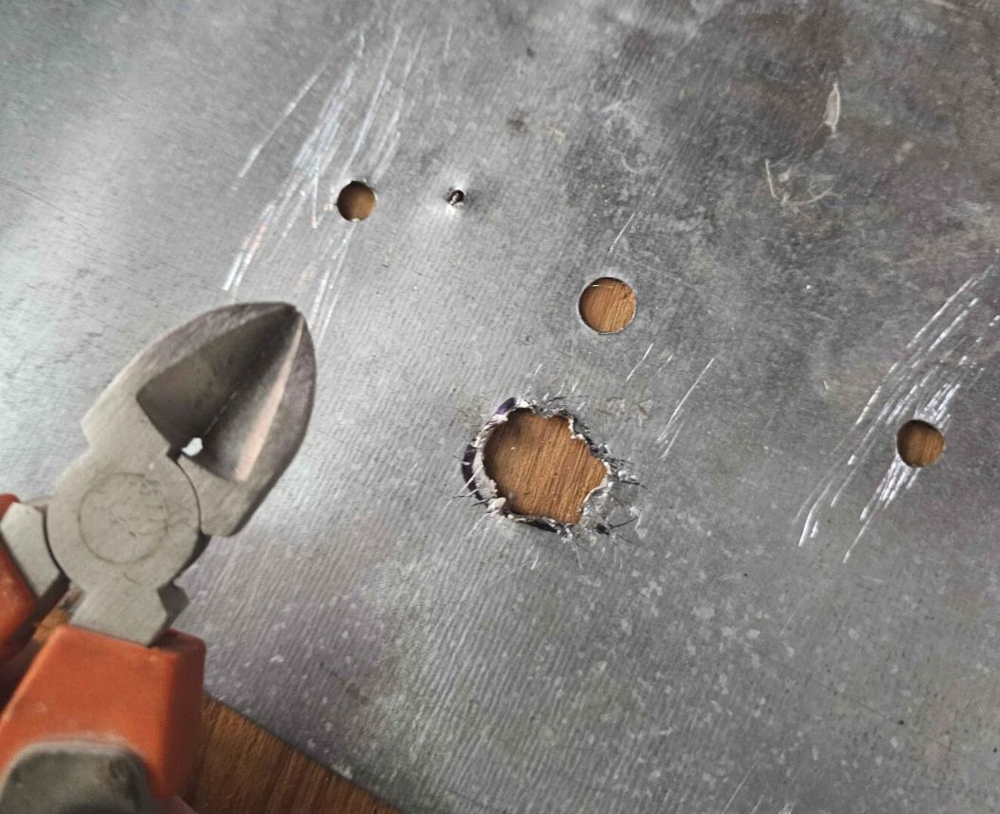  
*Like I said, not <u><b>completely</b></u> massacred, although the hole still looks horrible. Thankfully it doesn't matter, as this area is covered by the helix's own plate.*

> Please note that the pliers pictured are not the metal cutting ones I used, I only used these to get rid of small poky bits. You can put your pitchforks down.

## Putting everything together

First, put the SMA of your choosing on the Helix's plate, then install the scaffold. You can then solder the helix wire to the SMA. 

The primary plate uses the same mounting bolts as for the scaffold, making the installation of it very simple - remove the nuts from the mounting bolts, slide the additional plate on top, then put the nuts right back. Make sure to tighten them well to ensure good electrical contact. 

Now, you might already see a potential issue:

When installing the primary plate onto the helix's, you have to remove the nut which holds the scaffold down to the helix plate. This means, that the SMA's fragile soldering takes all the stress. That can easily break!

To remedy this, you can do three things:

1. Drill a hole somewhere else in the ground plane like in the center, run a flat-headed screw through it into the scaffold to hold it down
2. Use hot glue or another adhesive to hold the scaffold down
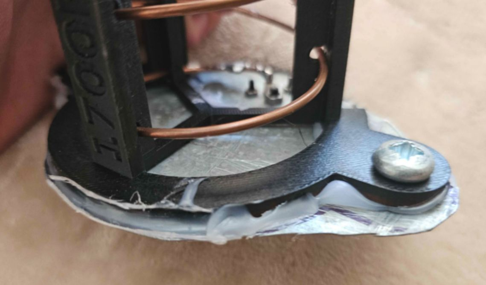  
*This was my solution. While not permanent, it does good-enough of a job to hold the plate down while installing the primary plate for me to feel safe doing so.*

3. Just leave it as-is and be extra careful while installing the primary plate. If possible, you can also install the primary plate upside down - hold the helix plate helix-side down, slide the primary plate on top. This way, the weight never bears down on the fragile soldering.

Regardless of your approach, while installing the primary plate, make sure to hold the helix plate like this: 
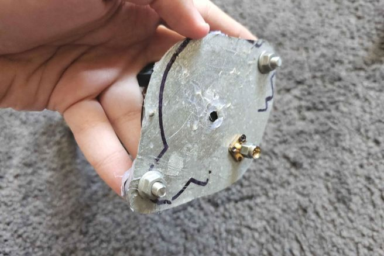  
*Hold it from the helix side, cover the two screws with two of your fingers to prevent them from spinning around. You can also use your thumb to hold the plate down. Use your other hand to remove the nuts. This way, the soldering has no pressure on it as the plate is placed upon the scaffold. Slide the primary ground plane over the two bolts and hand-tighten the two nuts. You can now safely let go of the helix side and use a wrench or pliers to tighten the nuts some more if needed.*

---

You're now done!

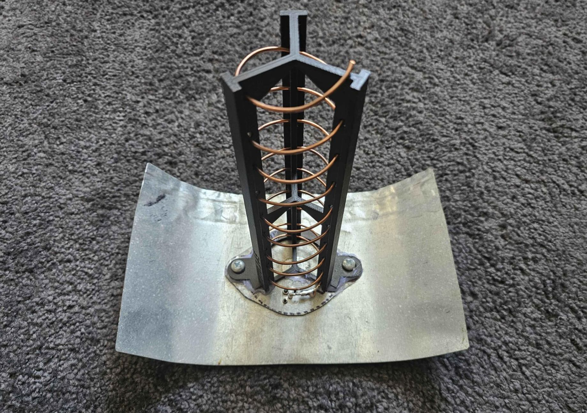  
*The final helix, with the helix plate screwed down onto the primary one*

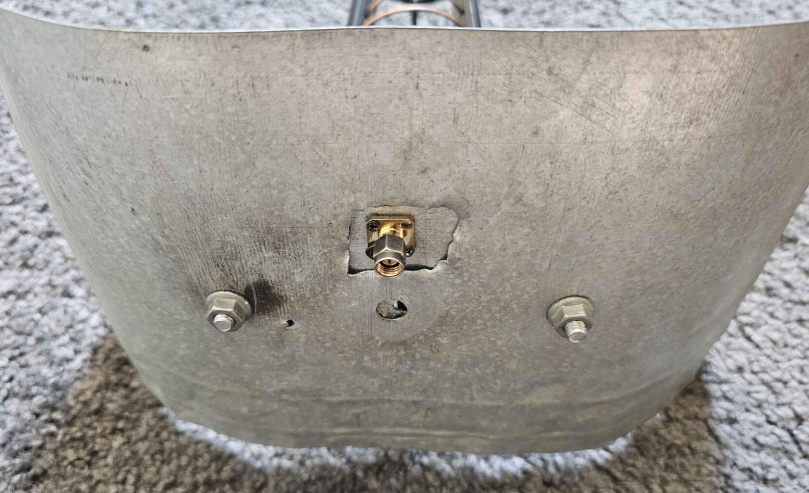  
*Rearview look of the final helix. Notice how the SMA passes through the big plane.*

## Handle

> Please note that I am not a mechanical engineer, am just working based off of intuition and experience. Take any stress descriptions with a pinch of salt.

My original design relied on holding the SMA between the SawBird and the feed, and the feed edge. Doing this is very uncomfortable, and puts a lot of direct stress onto the SawBird's SMA. It also breaks the feed's SMA over time with wear, making it not spin anymore. Quite annoying to deal with!

In later iterations I used a screw drilled sideways as a sort of 'ghetto' handle, but that just cut me more times than I can count and got really unstable over time.

The solution I went with for this design is to use the [SawBird cover](https://www.thingiverse.com/thing:6682161) designed by T0nito. The bulk of the mechanical stress goes through the cover and into the actual ground plane, allowing you to use it as a handle. The important part is installing it correctly though:

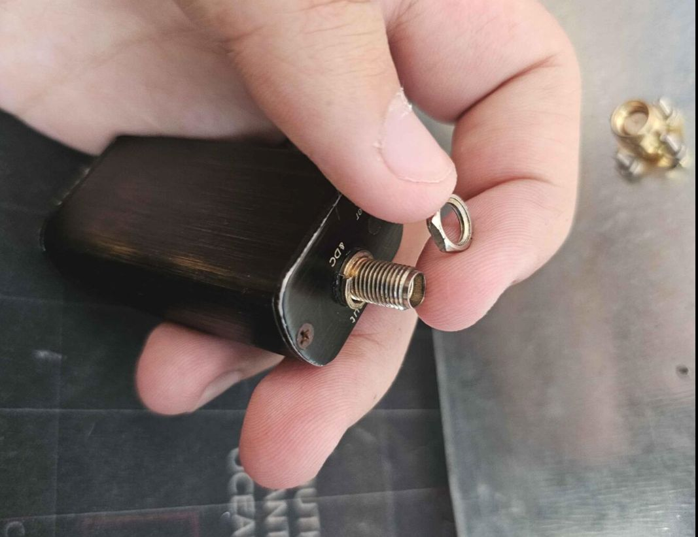  
*1. Remove the SMA nut from the 'Output' side of your SawBird*

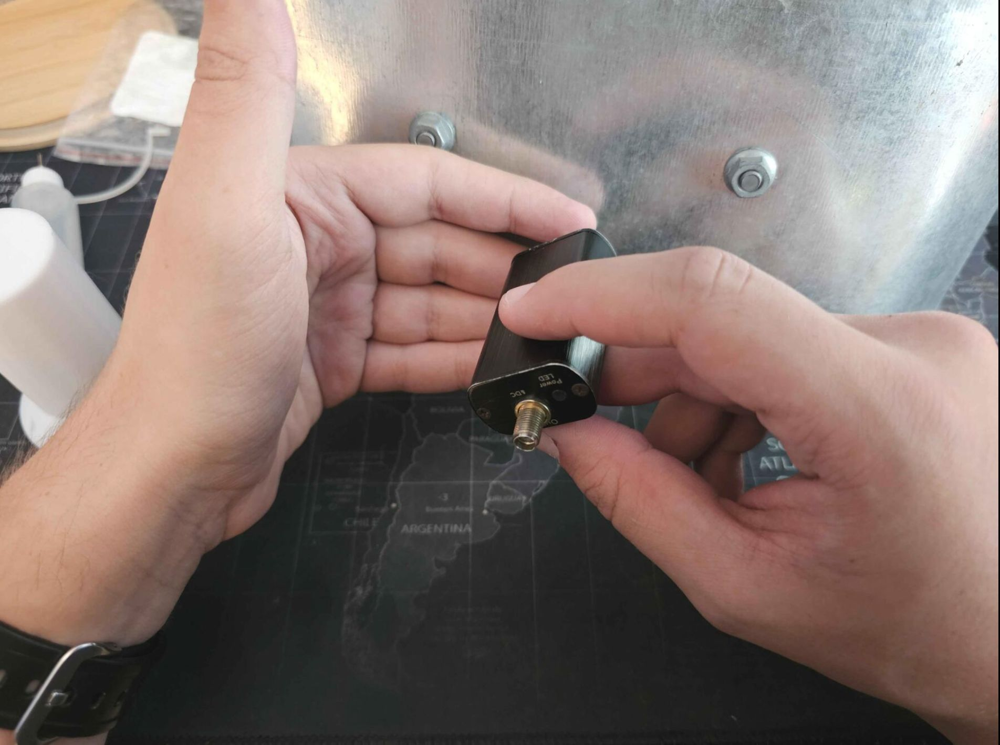  
*2. Hold the SMA on your feed in place with one hand, use the other to screw the SawBird in until it's nice and tight*

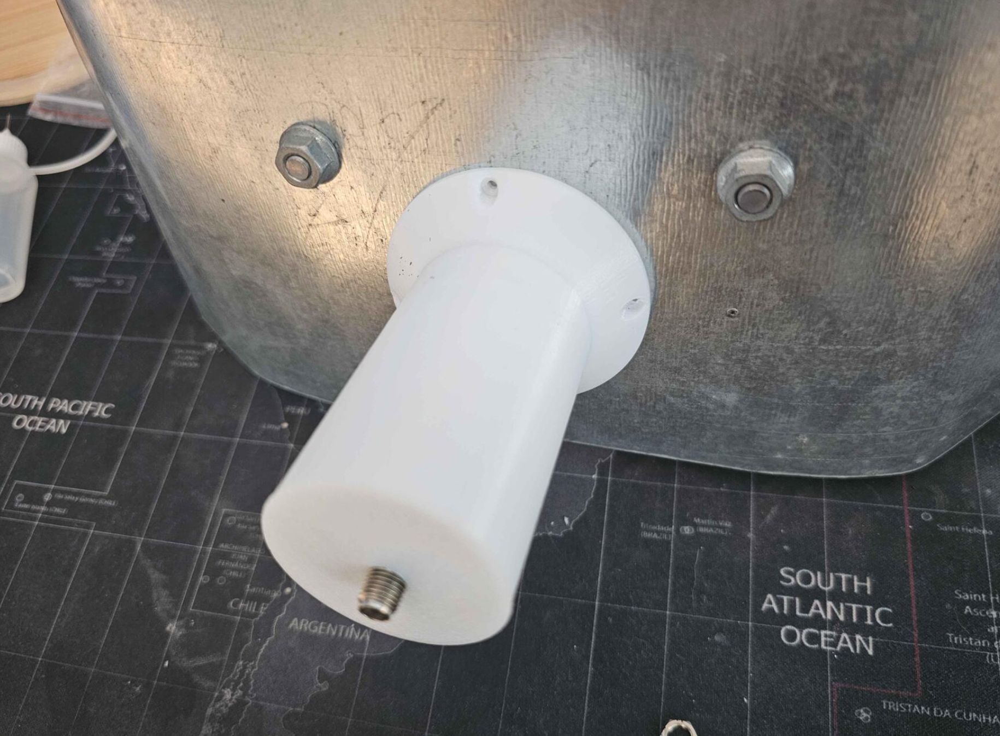  
*3. Slide the cover on, running the output SMA through the hole at the bottom. If you have a big gap between the handle and the ground plane, you did something wrong! It should be able to sit flush.*

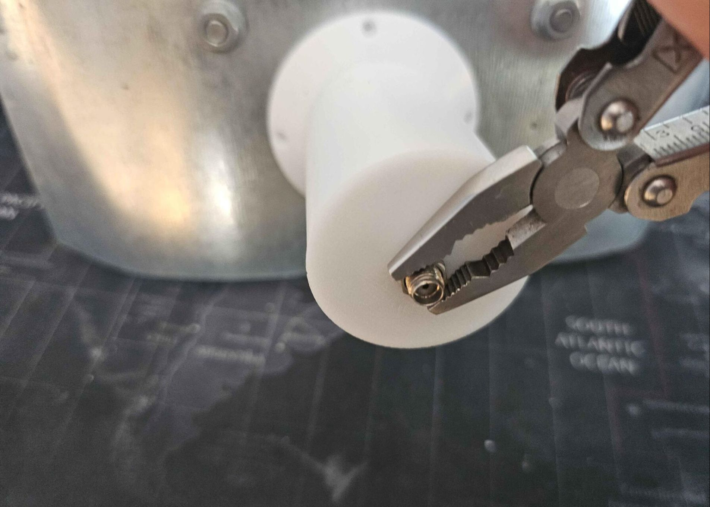  
*4. Put the SMA nut back, tighten it until there is no gap left between the cover and the ground plane, and you have enough threads exposed to screw in your cabling. **Make sure the cover sits flush with the plate, because if there is a gap - even small - it stops being load-bearing! This means, that your SawBird's input SMA becomes load-bearing instead, risking snapping it off!!!***

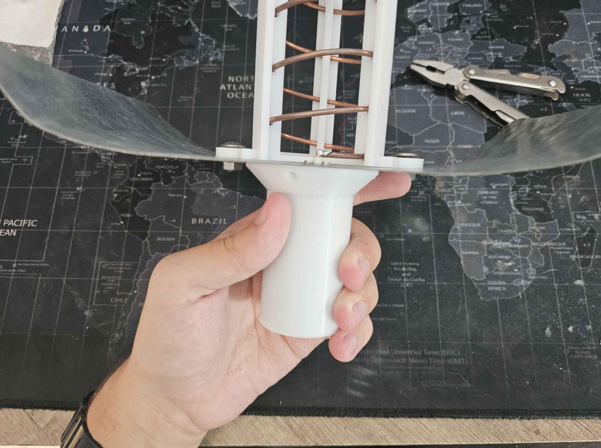  
*5. You're done! The images used a single ground plane, but yours should look identical. The lack of a gap shows that the cover is installed correctly and can be used as a handle!*

# Results

Having finally restored my ability to do L-band satellite reception, I went out to test it out on the first pass I could. It showed two things
1. I've forgotten how tricky it is to track with this type of antenna
2. The imagery it gets is remarkably noise-free for what it is

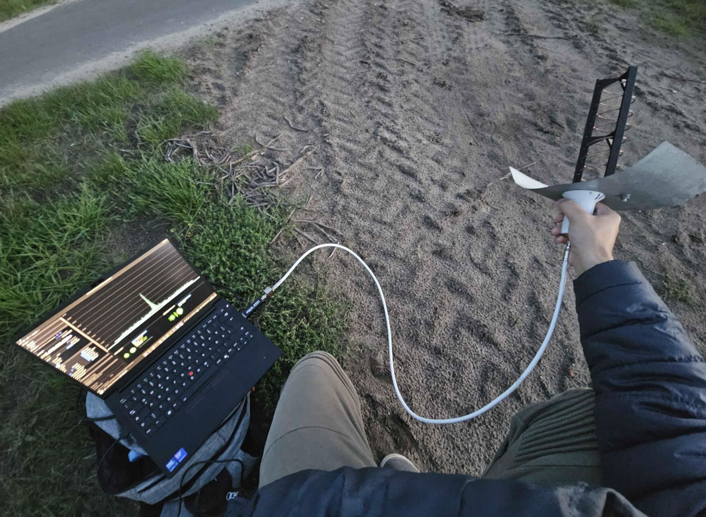
*The first GGAK test I did on Elektro-L2, it pleasantly surprised me with around 12 dB peak SNR.*

A Meteor pass soon followed:

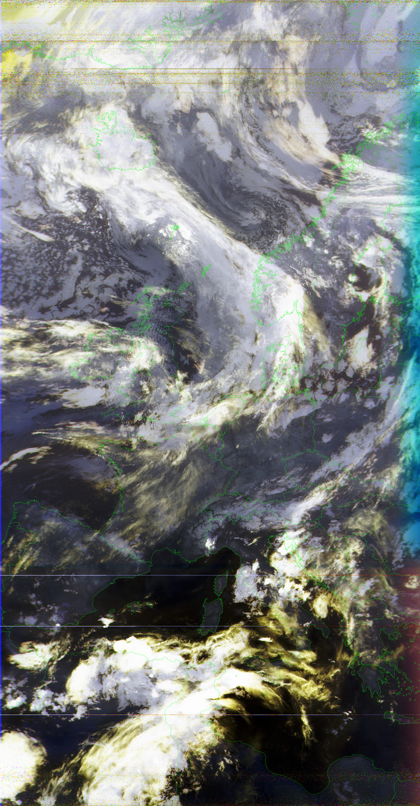  
*Meteor M2-3 HRPT received at 20:07 UTC on 18-09-2026 using the direct reception helix pictured above with a SawBird GOES+ and a LibreSDR B210 Mini. Processed with SatDump using the `AVHRR 543b` composite. Lossy JPEG-compression applied at 25% original resolution. Full-resolution JPEG can be found [here](../../assets/images/Improved-helix/Meteor-M2-3_20-07_18-09-2026_AVHRR543b.jpg)*

The Meteor pass showed that data is receivable as low as 0°, with the SNR averaging around 46 dB below 10° elevation and at 10-11 dB above 10°. MetOp-B also passed that evening but was less glorious due to an ongoing modulator issue:

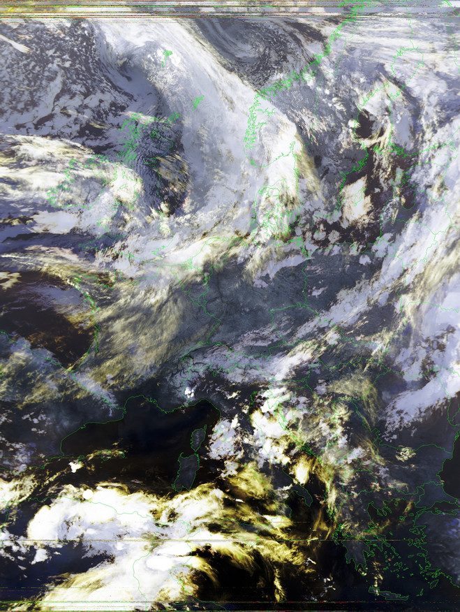  
*MetOp-B AHRPT received at 20:07 UTC on 18-09-2026 using the direct reception helix pictured above with a SawBird GOES+ and a LibreSDR B210 Mini. Processed with SatDump using the `AVHRR 543b` composite. Lossy JPEG-compression applied at 25% original resolution. Full-resolution JPEG can be found [here](../../assets/images/Improved-helix/MetOp-B_19-38_18-09-2026_AVHRR543b.jpg)*

It still showed that MetOp can be received with this setup, even without signal dropouts! Although the SNR threshold of data is higher due to FEC and a higher bandwidth, meaning you only start decoding data at around 10°. Still totally usable!

---

I didn't do passes for a few days as I was sick, the few I did anyway had a handful of hardware issues that I had to iron out (broken coaxial cable accounted for most of them). I did one more I want to include here just before writing this article:

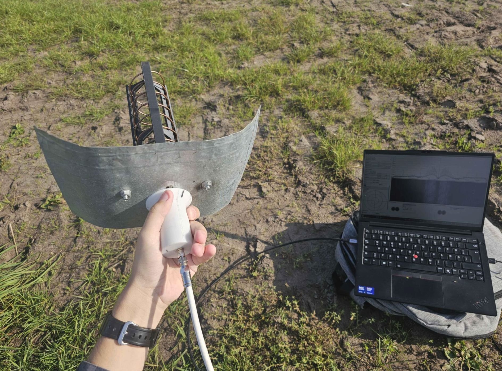
*Yours truly pointing at Meteor M2-3 while it was at roughly just 3°, already showing 4-6 dB.*

  
*Meteor M2-3 HRPT received at 8:31 UTC on 27-09-2026 using the direct reception helix pictured above with a SawBird GOES+ and a LibreSDR B210 Mini. Processed with SatDump using the `AVHRR 3a21` composite. Lossy JPEG-compression applied at 25% original resolution. Full-resolution JPEG can be found [here](../../assets/images/Improved-helix/Meteor-M2-3_08-31_27-09-2026_AVHRR3a21.jpg)*

I finally got used to the tracking methods with this pass, and easily got a stable noise-free 10 dB from 10°-10°, peaking at 13 dB. Not bad for having no dish!

# Tracking remarks

This thing is very difficult to track with at first. Because of the small form factor, things that you take for granted with a dish have to be handled by you:

## Distance from ground

Having no secondary reflector, you **must** use the ground to your advantage! You constantly have to battle the radiation pattern for optimal signal strength - at specific heights above the ground, the signal might become weak or disappear completely. Moving up or down by a wavelength then has it come back at full strength. 

As an additional note, sometimes, moving through two of these "nulls" at a time can have it become significantly stronger. I.e. near the horizon, the signal is strong when the helix is almost on the ground. Going up you get:
- A null where it completely disappears
- A point about 50 cm above the ground where it becomes strong again
- Another null where it completely disappears
- The strongest point from my testing at around 1 meter above the ground. Compared to ground level, the improvement is often in the ballpark of 4 dB
 
The optimal height above ground changes drastically throughout the pass, especially when approaching the horizon (<15°).

## Skew

The feed being asymmetric as well as having a lot of side lobes brings in a lot of external interference, You constantly have to be checking for skew - skewing the helix properly will reject any ground interference and improve your SNR by quite a bit.

# Future

The testing showed that this design is definitely viable for satellite reception, especially if you need to travel to get your passes. I do have some remarks I would like to add about this design:

## Potential points of failure

While relatively robust, there are a few points which might need some more engineering work:

### Handle

The handle is the most obvious one. Since it still relies on the SMA of the SawBird to some extent, it can fail over time. 

Potential solutions include:
- Making a separate, big hole in the center of the primary plate, then attaching a handle permanently to the helix plate and using it through said hole. Having such a huge hole in the primary plate might affect its structural rigidity though.
- Using a design similar to T0nito's helicone - a handle which uses the same mounting holes as the helix/plates. This would probably be the best solution, as it just requires you to get some larger bolts. Only issue it might create is SMA clearance, but you can just leave a piece of the handle cut out to avoid it.

### SMA soldering

The helix plate has to be detached from the scaffold while installing the big ground plane. This might introduce unwanted stress on the SMA soldering. As mentioned earlier, potential solutions are:

- Using a permanent screw to hold the scaffold in place. As long as the helix plate remains flat from the bottom, it shouldn't matter what you add to it. Therefore, a flat-headed screw might work.
- Using hot glue or other adhesives. The only concern is them degrading over time. This can be managed with maintenance.

### Scaffold breaking over time

The scaffold is also a fairly fragile piece, which might break with accidental drops etc. This can be remedied by using materials with better structural rigidity such as ABS/PETG paired with good infill types and percentages. A potential modification to the scaffold design that adds a 4th structural strut would also significantly help rigidity.

## Other remarks

While testing the design I also noticed some potential points of concern:

### Electrical connection between the two plates

Since the SMA on the helix plate has no physical contact to the primary plate, the two plates need to be properly smushed together for good electrical continuity. If both are kept perfectly flat, this is not a concern. **However, if one is slightly deformed, some areas might still be lifted even after the bolts are properly tightened**. For example, my feed uses relatively thin plates which have undergone quite a few bends in the past, permanently deforming some sections. These create tiny gaps between the helix plate and the primary plate.

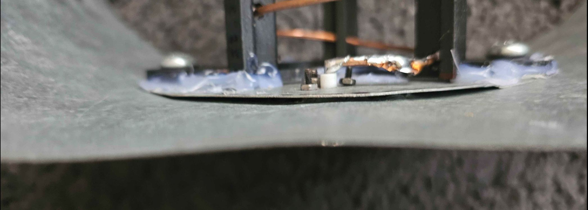

When a VNA is connected, pressing on the plate where the gap present causes a minor change in SWR. However, I haven't been able to notice any impacts on actual signal strength.

A potential solution is just adding an extra screw or two somewhere like between the struts of the helix plate to allow for more points of contact. **But, given that I couldn't produce a difference in measured SNR, I think this can safely be ignored.**

### Using a third plate

You can technically use longer bolts and a third plate mounted at a 90° angle, this would make the reflectors an X shape. It might greatly aid signal strength as you effectively almost double the surface area. It is especially feasible, as adding a second primary plate doesn't increase the footprint by much when the helix is stowed. Definitely worth looking into!

# Epilogue

This design allows you to make a portable reception setup which can easily get you L-band imagery from basically anywhere. The design concerns are only minor, the results speak for themselves.

I hope you learned something new, or even decided to make this design. If you have any questions or remarks, feel free to message me either on Twitter (@Meti172172), or on Discord @meti172.

---
Now go get some pretty pictures!
